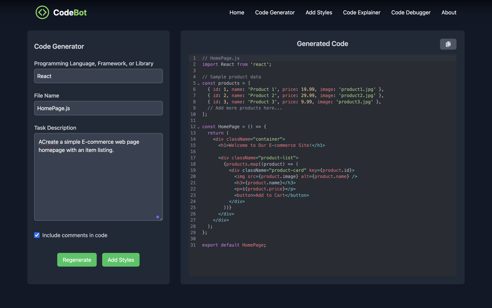
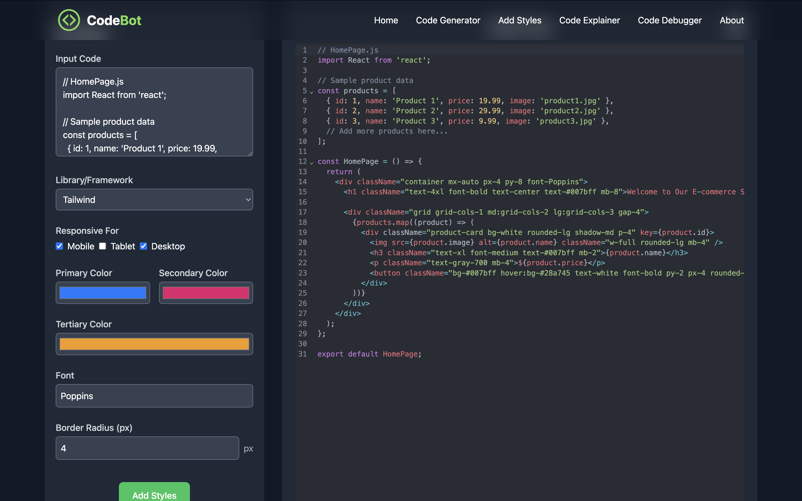
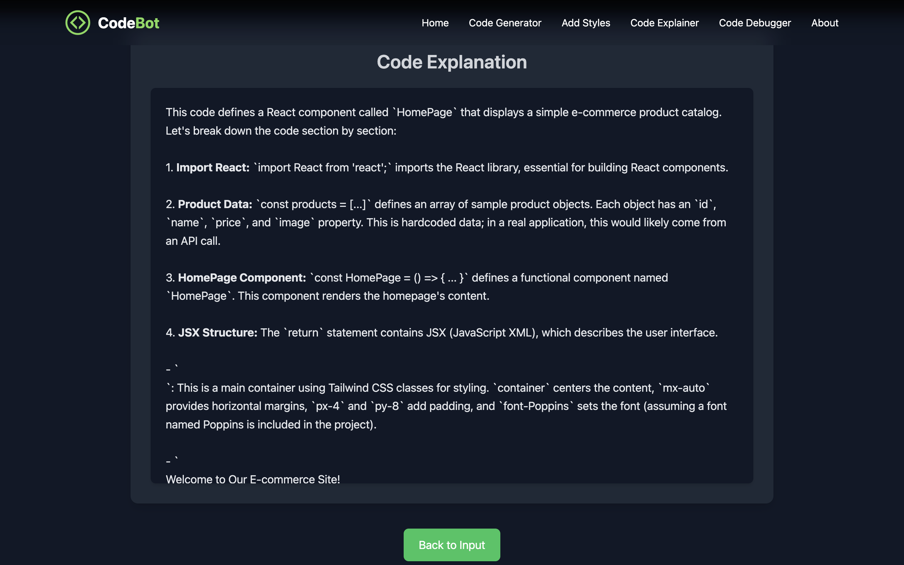
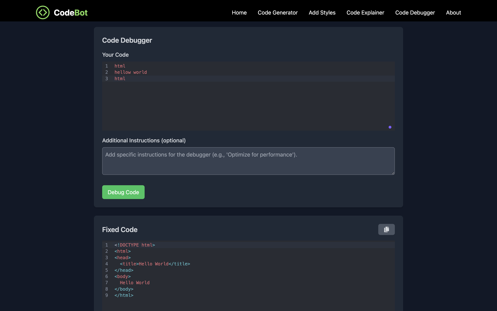

# CodeBot.ai

CodeBot is a powerful AI-driven web application that provides multiple functionalities to simplify and enhance the coding process. Built with **React** and styled using **Tailwind CSS**, this app ensures a modern, responsive, and user-friendly interface.
 
## Features

- **Code Generator**: Generate boilerplate code snippets for various programming needs.
  

- **Add Styles**: Automatically style code blocks with custom themes.
-  
- **Code Explainer**: Paste code to get detailed explanations and understand its functionality.
-  
- **Code Debugger**: Identify and fix errors in your code efficiently.
-  
- **Responsive Design**: Optimized for both desktop and mobile devices.

## Tech Stack

- **Frontend**: React
- **Styling**: Tailwind CSS
- **Code Editor**: CodeMirror
- **Backend AI Integration**:  AI API for code generation and explanation.

Happy Coding!
